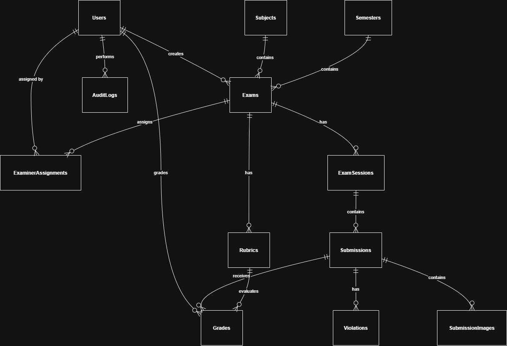

# PRN232 Assignment Grading System

A comprehensive assignment grading and checking system built with ASP.NET Core 8.0 and SQL Server.

## 📋 Project Overview

This is an automated assignment grading system that allows:
- Assignment submission and management
- Automated grading with customizable rubrics
- Background job processing for batch operations
- File upload and storage management
- Score tracking and reporting

## Use Case Breakdown for Team Implementation

### **Use Case 1: Exam Setup & Management**
**Actors:** Admin, Manager  
**Preconditions:** User authenticated with appropriate role  
**Main Flow:**
1. Admin creates subjects and semesters
2. Manager creates exams linked to subjects/semesters
3. System generates rubrics for each exam
4. Manager assigns examiners to specific exams
**Postconditions:** Exam ready for student submissions  
**Alternative Flows:** Validation errors if dates conflict

### **Use Case 2: Submission Upload & Processing**
**Actors:** System (automated), Examiner (manual upload)  
**Preconditions:** Exam session active, RAR file available  
**Main Flow:**
1. Extract RAR archive containing student submissions
2. Validate file naming conventions
3. For each submission:
   - Check for duplicate content within session
   - Extract images from Word documents
   - Detect content violations
   - Store file metadata and violation flags
4. Update submission status to "Processing"
5. Notify relevant users via SignalR
**Postconditions:** All submissions processed and flagged for violations  
**Exception Flows:** Large files handled with streaming, corrupt files logged

### **Use Case 3: Grading Workflow**
**Actors:** Examiner, Moderator  
**Preconditions:** Submission processed, examiner assigned  
**Main Flow:**
1. Examiner accesses assigned submissions
2. For each rubric criteria, enters score and comments
3. System prevents duplicate grading per examiner/rubric
4. If multiple examiners grade same submission, calculate average
5. Moderator reviews zero-score submissions due to violations
6. Final scores approved by moderator
**Postconditions:** Submission marked as "Graded"  
**Business Rules:** Double grading for fairness, moderator verification required

### **Use Case 4: Dashboard & Reporting**
**Actors:** Admin, Manager, Moderator  
**Preconditions:** User authenticated, has dashboard access  
**Main Flow:**
1. User queries exam data using OData filters
2. System aggregates scores, violations, and progress metrics
3. Display real-time updates via SignalR
4. Export filtered results to Excel format
5. Generate summary reports for approval
**Postconditions:** Reports exported, data visualized  
**Technical Requirements:** OData for complex querying, pagination for performance

### **Use Case 5: Real-time Notifications**
**Actors:** All users  
**Preconditions:** User connected to SignalR hub  
**Main Flow:**
1. System detects submission upload/grading events
2. Broadcast notifications to relevant user groups
3. Update dashboard counters in real-time
4. Push alerts for urgent violations or deadlines
**Postconditions:** Users notified of system changes  
**Non-functional:** Low latency, reliable delivery

### **Use Case 6: Security & Access Control**
**Actors:** All users  
**Preconditions:** User attempts to access system  
**Main Flow:**
1. User provides credentials
2. System validates JWT token and role permissions
3. API Gateway enforces authorization policies
4. Audit log captures access attempts
**Postconditions:** Authorized access granted or denied  
**Security Requirements:** JWT expiration, role-based endpoints

### **Use Case 7: WPF Client Upload (Optional)**
**Actors:** Examiner  
**Preconditions:** WPF application installed, exam files available  
**Main Flow:**
1. Examiner selects RAR archive
2. Client validates file format and size
3. Extract and preprocess submissions locally
4. Upload processed data to cloud API
5. Display progress and handle errors
**Postconditions:** Submissions uploaded to backend  
**Alternative:** Full cloud processing if WPF not chosen

This use case breakdown provides clear, actionable tasks that your team can discuss and assign based on individual strengths and workload capacity.

## Entity-by-Entity Explanation

Below is a detailed breakdown of each entity in the database design, explaining its purpose, relationships, business flows/use cases it supports, and the specific assignment requirements it addresses.



### 1. **Users**
**Meaning:** Represents system users with different roles (Admin, Manager, Moderator, Examiner) who interact with the platform.

**Business Flow/Use Cases:**
- Authentication and authorization across all use cases
- Role-specific operations (e.g., Admin manages system config, Manager assigns examiners)

**Relationships:**
- One-to-many with Exams (creates exams)
- One-to-many with ExaminerAssignments (assigns/assigned to exams)
- One-to-many with Grades (examiners grade submissions)
- One-to-many with AuditLogs (tracks user actions)

**Requirements Addressed:**
- "Roles and Business Logic" section: Supports Admin, Manager, Moderator, Examiner roles
- "Security" section: JWT authentication and role-based authorization

**Detailed Field Explanations:**
| Field | Type | Constraints | Purpose & Business Use |
|-------|------|-------------|-------------------------|
| UserId | UNIQUEIDENTIFIER | PRIMARY KEY DEFAULT NEWSEQUENTIALID() | Unique identifier for system users. Used in all relationships and audit trails. |
| Username | NVARCHAR(50) | UNIQUE, NOT NULL | Login username. Must be unique across the system for authentication. |
| Email | NVARCHAR(100) | UNIQUE, NOT NULL | User's email address. Used for notifications and password recovery. |
| PasswordHash | NVARCHAR(255) | NOT NULL | Hashed password for security. Never stored in plain text. |
| Role | NVARCHAR(20) | NOT NULL, CHECK IN ('Admin', 'Manager', 'Moderator', 'Examiner') | Defines user's permissions and accessible features. Core to role-based authorization. |
| IsActive | BIT | DEFAULT 1 | Soft delete flag. Allows deactivating users without data loss. |
| CreatedAt | DATETIME2 | DEFAULT GETUTCDATE() | Timestamp of user creation. Used for auditing and sorting. |
| UpdatedAt | DATETIME2 | DEFAULT GETUTCDATE() | Last modification timestamp. Tracks user profile changes. |

### 2. **Subjects**
**Meaning:** Academic subjects/courses that exams are based on (e.g., PRN232, Math, etc.).

**Business Flow/Use Cases:**
- Exam Setup & Management: Admin creates subjects as foundation for exams

**Relationships:**
- One-to-many with Exams (each exam belongs to one subject)

**Requirements Addressed:**
- "System Architecture" section: "microservices responsible for managing subjects"
- Provides context for organizing exams by academic discipline

**Detailed Field Explanations:**
| Field | Type | Constraints | Purpose & Business Use |
|-------|------|-------------|-------------------------|
| SubjectId | UNIQUEIDENTIFIER | PRIMARY KEY DEFAULT NEWSEQUENTIALID() | Unique subject identifier. Links exams to academic disciplines. |
| SubjectCode | NVARCHAR(20) | UNIQUE, NOT NULL | Short code (e.g., "PRN232"). Used in reports and UI displays. |
| SubjectName | NVARCHAR(100) | NOT NULL | Full subject name. Human-readable identifier for exams. |
| Description | NVARCHAR(500) | - | Optional details about the subject. Helps administrators understand context. |
| CreatedAt | DATETIME2 | DEFAULT GETUTCDATE() | Creation timestamp. Tracks when subjects were added to the system. |

### 3. **Semesters**
**Meaning:** Academic periods (e.g., Fall 2024, Spring 2025) that group exams chronologically.

**Business Flow/Use Cases:**
- Exam Setup & Management: Admin creates semesters to organize exam schedules

**Relationships:**
- One-to-many with Exams (exams occur within specific semesters)

**Requirements Addressed:**
- "System Architecture" section: "microservices responsible for managing... semesters"
- Enables tracking exams by academic timeline

**Detailed Field Explanations:**
| Field | Type | Constraints | Purpose & Business Use |
|-------|------|-------------|-------------------------|
| SemesterId | UNIQUEIDENTIFIER | PRIMARY KEY DEFAULT NEWSEQUENTIALID() | Unique semester identifier. Groups exams by academic period. |
| SemesterCode | NVARCHAR(20) | UNIQUE, NOT NULL | Code like "FA2024". Used for filtering and reporting. |
| SemesterName | NVARCHAR(100) | NOT NULL | Full name (e.g., "Fall 2024"). Display name in interfaces. |
| StartDate | DATE | NOT NULL | Semester start date. Validates exam scheduling. |
| EndDate | DATE | NOT NULL | Semester end date. Ensures exams fall within valid periods. |
| IsActive | BIT | DEFAULT 1 | Active status. Prevents scheduling exams in inactive semesters. |

### 4. **Exams**
**Meaning:** Individual programming exams with specific details like date, duration, and total marks.

**Business Flow/Use Cases:**
- Exam Setup & Management: Manager creates and configures exams
- Submission Upload & Processing: Provides context for submissions
- Grading Workflow: Defines what examiners grade against

**Relationships:**
- Many-to-one with Subjects and Semesters
- One-to-many with Rubrics (grading criteria)
- One-to-many with ExamSessions (multiple sessions per exam)
- One-to-many with ExaminerAssignments (examiners assigned to exam)
- Many-to-one with Users (created by admin/manager)

**Requirements Addressed:**
- "System Architecture" section: "managing... exams"
- "Roles and Business Logic": Manager assigns examiners to grade submissions
- Foundation for the entire grading system

**Detailed Field Explanations:**
| Field | Type | Constraints | Purpose & Business Use |
|-------|------|-------------|-------------------------|
| ExamId | UNIQUEIDENTIFIER | PRIMARY KEY DEFAULT NEWSEQUENTIALID() | Unique exam identifier. Central entity for the grading system. |
| SubjectId | UNIQUEIDENTIFIER | NOT NULL, FK to Subjects | Links exam to its academic subject. |
| SemesterId | UNIQUEIDENTIFIER | NOT NULL, FK to Semesters | Associates exam with academic period. |
| ExamName | NVARCHAR(200) | NOT NULL | Descriptive exam title. Used in UI and reports. |
| ExamDate | DATETIME2 | NOT NULL | Scheduled exam date and time. |
| DurationMinutes | INT | NOT NULL | Exam length in minutes. Used for submission validation. |
| TotalMarks | DECIMAL(5,2) | NOT NULL | Maximum possible score. Used for grade calculations. |
| CreatedBy | UNIQUEIDENTIFIER | NOT NULL, FK to Users | Admin/Manager who created the exam. For audit purposes. |
| CreatedAt | DATETIME2 | DEFAULT GETUTCDATE() | Creation timestamp. |

### 5. **Rubrics**
**Meaning:** Detailed grading criteria for each exam, specifying what aspects are evaluated and their point values.

**Business Flow/Use Cases:**
- Exam Setup & Management: Manager defines rubrics when creating exams
- Grading Workflow: Examiners use rubrics to score submissions

**Relationships:**
- Many-to-one with Exams
- One-to-many with Grades (scores for each rubric item)

**Requirements Addressed:**
- "System Architecture" section: "managing... rubrics"
- "Roles and Business Logic": "Examiner: Grade submissions based on rubrics"

**Detailed Field Explanations:**
| Field | Type | Constraints | Purpose & Business Use |
|-------|------|-------------|-------------------------|
| RubricId | UNIQUEIDENTIFIER | PRIMARY KEY DEFAULT NEWSEQUENTIALID() | Unique rubric item identifier. |
| ExamId | UNIQUEIDENTIFIER | NOT NULL, FK to Exams | Links rubric to specific exam. |
| Criteria | NVARCHAR(200) | NOT NULL | Description of what is being evaluated (e.g., "Code Quality"). |
| MaxPoints | DECIMAL(5,2) | NOT NULL | Maximum points for this criteria. |
| Description | NVARCHAR(500) | - | Detailed explanation of the criteria. Guides examiners. |

### 6. **ExamSessions**
**Meaning:** Specific time slots or batches within an exam where student submissions are grouped (e.g., Morning session, Afternoon session).

**Business Flow/Use Cases:**
- Submission Upload & Processing: Groups submissions for batch processing and duplicate detection
- Dashboard & Reporting: Allows filtering reports by session

**Relationships:**
- Many-to-one with Exams
- One-to-many with Submissions (all submissions in a session)

**Requirements Addressed:**
- "Input Data Handling": "Check for duplicate content among submissions within the same exam session"
- Enables efficient processing of large numbers of submissions

**Detailed Field Explanations:**
| Field | Type | Constraints | Purpose & Business Use |
|-------|------|-------------|-------------------------|
| SessionId | UNIQUEIDENTIFIER | PRIMARY KEY DEFAULT NEWSEQUENTIALID() | Unique session identifier. Groups submissions for processing. |
| ExamId | UNIQUEIDENTIFIER | NOT NULL, FK to Exams | Links session to parent exam. |
| SessionName | NVARCHAR(100) | NOT NULL | Name like "Morning Session". Used for organization. |
| StartTime | DATETIME2 | NOT NULL | Session start time. |
| EndTime | DATETIME2 | NOT NULL | Session end time. |
| IsActive | BIT | DEFAULT 1 | Active status for submission acceptance. |

### 7. **Submissions**
**Meaning:** Individual student exam files submitted for grading, including metadata and processing status.

**Business Flow/Use Cases:**
- Submission Upload & Processing: Core entity for file handling and validation
- Grading Workflow: What examiners grade
- Real-time Notifications: Status changes trigger updates

**Relationships:**
- Many-to-one with ExamSessions
- One-to-many with Violations (detected issues)
- One-to-many with SubmissionImages (extracted images)
- One-to-many with Grades (scores from examiners)

**Requirements Addressed:**
- "Input Data Handling": All bullet points about RAR extraction, violation detection, duplicate checking, image extraction
- "Roles and Business Logic": Core of examiner grading and moderator verification

**Detailed Field Explanations:**
| Field | Type | Constraints | Purpose & Business Use |
|-------|------|-------------|-------------------------|
| SubmissionId | UNIQUEIDENTIFIER | PRIMARY KEY DEFAULT NEWSEQUENTIALID() | Unique submission identifier. |
| SessionId | UNIQUEIDENTIFIER | NOT NULL, FK to ExamSessions | Links to exam session. |
| StudentId | NVARCHAR(50) | NOT NULL | Student identifier (ID number). |
| StudentName | NVARCHAR(100) | - | Student's full name. Optional for anonymity. |
| FileName | NVARCHAR(255) | NOT NULL | Original filename. Used for validation. |
| FilePath | NVARCHAR(500) | NOT NULL | Storage location of the file. |
| FileSize | BIGINT | - | File size in bytes. Used for processing limits. |
| ContentHash | NVARCHAR(128) | - | SHA hash for duplicate detection. |
| SubmissionTime | DATETIME2 | DEFAULT GETUTCDATE() | When submission was uploaded. |
| Status | NVARCHAR(20) | DEFAULT 'Pending', CHECK IN ('Pending', 'Processing', 'Graded', 'Flagged') | Current processing state. |

### 8. **Violations**
**Meaning:** Detected issues with submissions (naming violations, duplicate content, etc.) that may affect grading.

**Business Flow/Use Cases:**
- Submission Upload & Processing: Created during automated scanning
- Grading Workflow: Moderator verifies zero-score submissions due to violations

**Relationships:**
- Many-to-one with Submissions

**Requirements Addressed:**
- "Input Data Handling": "Scan and detect violations related to file naming conventions and source code content"
- "Roles and Business Logic": "Moderator: verify submissions marked with zero points due to violations"

**Detailed Field Explanations:**
| Field | Type | Constraints | Purpose & Business Use |
|-------|------|-------------|-------------------------|
| ViolationId | UNIQUEIDENTIFIER | PRIMARY KEY DEFAULT NEWSEQUENTIALID() | Unique violation identifier. |
| SubmissionId | UNIQUEIDENTIFIER | NOT NULL, FK to Submissions | Links violation to submission. |
| ViolationType | NVARCHAR(50) | NOT NULL | Type: 'Naming', 'Duplicate', 'Content'. |
| Description | NVARCHAR(500) | NOT NULL | Detailed explanation of the violation. |
| Severity | NVARCHAR(20) | DEFAULT 'Warning', CHECK IN ('Warning', 'Error') | Impact level. |
| DetectedAt | DATETIME2 | DEFAULT GETUTCDATE() | When violation was detected. |

### 9. **SubmissionImages**
**Meaning:** Images extracted from Word documents in submissions, stored separately for reference.

**Business Flow/Use Cases:**
- Submission Upload & Processing: Created during document processing

**Relationships:**
- Many-to-one with Submissions

**Requirements Addressed:**
- "Input Data Handling": "Extract images embedded in the Word file and store them separately"

**Detailed Field Explanations:**
| Field | Type | Constraints | Purpose & Business Use |
|-------|------|-------------|-------------------------|
| ImageId | UNIQUEIDENTIFIER | PRIMARY KEY DEFAULT NEWSEQUENTIALID() | Unique image identifier. |
| SubmissionId | UNIQUEIDENTIFIER | NOT NULL, FK to Submissions | Links to parent submission. |
| ImageName | NVARCHAR(255) | NOT NULL | Extracted image filename. |
| ImagePath | NVARCHAR(500) | NOT NULL | Storage location. |
| ImageSize | BIGINT | - | Image file size. |
| ExtractedAt | DATETIME2 | DEFAULT GETUTCDATE() | Extraction timestamp. |

### 10. **Grades**
**Meaning:** Individual scores given by examiners for specific rubric criteria on submissions.

**Business Flow/Use Cases:**
- Grading Workflow: Core of the grading process, supports double grading
- Dashboard & Reporting: Aggregated for final scores and reports

**Relationships:**
- Many-to-one with Submissions, Users (examiner), Rubrics
- Unique constraint prevents duplicate grading per examiner/rubric/submission

**Requirements Addressed:**
- "Roles and Business Logic": "Examiner: enter scores... conduct double grading if needed"
- "Final Outputs": "final graded scores"
- "Roles and Business Logic": "Support simultaneous grading of the same submission by multiple examiners"

**Detailed Field Explanations:**
| Field | Type | Constraints | Purpose & Business Use |
|-------|------|-------------|-------------------------|
| GradeId | UNIQUEIDENTIFIER | PRIMARY KEY DEFAULT NEWSEQUENTIALID() | Unique grade entry identifier. |
| SubmissionId | UNIQUEIDENTIFIER | NOT NULL, FK to Submissions | Links grade to submission. |
| ExaminerId | UNIQUEIDENTIFIER | NOT NULL, FK to Users | Which examiner gave this grade. |
| RubricId | UNIQUEIDENTIFIER | NOT NULL, FK to Rubrics | Which rubric criteria this grade addresses. |
| Points | DECIMAL(5,2) | NOT NULL | Awarded points (0 to MaxPoints). |
| Comments | NVARCHAR(500) | - | Examiner's feedback. |
| GradedAt | DATETIME2 | DEFAULT GETUTCDATE() | Grading timestamp. |
| IsFinal | BIT | DEFAULT 0 | Whether this is the final approved grade. |

### 11. **ExaminerAssignments**
**Meaning:** Links examiners to specific exams they are responsible for grading.

**Business Flow/Use Cases:**
- Exam Setup & Management: Manager assigns examiners
- Grading Workflow: Determines which submissions an examiner can access

**Relationships:**
- Many-to-one with Exams, Users (examiner and assigner)

**Requirements Addressed:**
- "Roles and Business Logic": "Manager: Assign examiners to grade submissions"

**Detailed Field Explanations:**
| Field | Type | Constraints | Purpose & Business Use |
|-------|------|-------------|-------------------------|
| AssignmentId | UNIQUEIDENTIFIER | PRIMARY KEY DEFAULT NEWSEQUENTIALID() | Unique assignment identifier. |
| ExamId | UNIQUEIDENTIFIER | NOT NULL, FK to Exams | Which exam the examiner is assigned to. |
| ExaminerId | UNIQUEIDENTIFIER | NOT NULL, FK to Users | Which user is the examiner. |
| AssignedBy | UNIQUEIDENTIFIER | NOT NULL, FK to Users | Manager who made the assignment. |
| AssignedAt | DATETIME2 | DEFAULT GETUTCDATE() | Assignment timestamp. |

### 12. **AuditLogs**
**Meaning:** System audit trail recording important actions for compliance and debugging.

**Business Flow/Use Cases:**
- Security & Access Control: Tracks all authentication and authorization events
- All use cases: Logs critical business actions

**Relationships:**
- Many-to-one with Users (who performed the action)

**Requirements Addressed:**
- "Security": "Secure data transmission and storage"
- General compliance and troubleshooting needs

**Detailed Field Explanations:**
| Field | Type | Constraints | Purpose & Business Use |
|-------|------|-------------|-------------------------|
| LogId | UNIQUEIDENTIFIER | PRIMARY KEY DEFAULT NEWSEQUENTIALID() | Unique log entry identifier. |
| UserId | UNIQUEIDENTIFIER | - , FK to Users | User who performed the action (nullable for system actions). |
| Action | NVARCHAR(100) | NOT NULL | Action performed (e.g., "Login", "Grade Submission"). |
| EntityType | NVARCHAR(50) | NOT NULL | Type of entity affected (e.g., "Submission", "Exam"). |
| EntityId | UNIQUEIDENTIFIER | NOT NULL | ID of the affected entity. |
| Details | NVARCHAR(1000) | - | Additional context or data changes. |
| Timestamp | DATETIME2 | DEFAULT GETUTCDATE() | When the action occurred. |

This entity mapping ensures the database directly supports all major business requirements while maintaining clean separation of concerns for microservices implementation.

## 🏗️ Architecture

- **API**: ASP.NET Core 8.0 Web API
- **Database**: SQL Server 2022
- **ORM**: Entity Framework Core 8.0
- **Background Jobs**: Hosted Service (JobWorker)
- **Containerization**: Docker & Docker Compose

## 🚀 Quick Start with Docker

This is the recommended way to run the application.

### Prerequisites

- [Docker Desktop](https://www.docker.com/products/docker-desktop) installed
- Docker Compose (included with Docker Desktop)

### Running with Docker

**1. Build and Start All Services**

```bash
docker-compose up --build
```

This command will:
- Build the .NET API Docker image
- Pull the SQL Server 2022 image
- Start both containers
- Create a network for them to communicate
- Initialize the database

**2. Access the Application**

Once the containers are running:
- **API**: http://localhost:5000
- **Swagger UI**: http://localhost:5000/swagger
- **SQL Server**: localhost:1433
  - Username: `sa`
  - Password: `YourStrong@Passw0rd`

## Docker Commands

### Start Services (Detached Mode)
```bash
docker-compose up -d
```

### Stop Services
```bash
docker-compose down
```

### Stop Services and Remove Volumes (Clean Database)
```bash
docker-compose down -v
```

### View Logs
```bash
# All services
docker-compose logs -f

# Specific service
docker-compose logs -f api
docker-compose logs -f sqlserver
```

### Rebuild Images
```bash
docker-compose build --no-cache
```

### Restart a Specific Service
```bash
docker-compose restart api
```

## Configuration

### Database Connection

The connection string is configured in `docker-compose.yml`:
```
Server=sqlserver;Database=Swd392;User Id=sa;Password=YourStrong@Passw0rd;TrustServerCertificate=True
```

### Change SQL Server Password

1. Update the password in `docker-compose.yml`:
   ```yaml
   sqlserver:
     environment:
       - MSSQL_SA_PASSWORD=YourNewPassword
   
   api:
     environment:
       - ConnectionStrings__Default=Server=sqlserver;Database=Swd392;User Id=sa;Password=YourNewPassword;...
   ```

2. Rebuild and restart:
   ```bash
   docker-compose down -v
   docker-compose up --build
   ```

### Ports

Default ports can be changed in `docker-compose.yml`:
- API: Change `"5000:8080"` to `"YOUR_PORT:8080"`
- SQL Server: Change `"1433:1433"` to `"YOUR_PORT:1433"`

## Troubleshooting

### Database Connection Issues

If the API can't connect to the database:
1. Check if SQL Server is healthy:
   ```bash
   docker-compose ps
   ```
2. Wait for SQL Server to be fully ready (can take 30-60 seconds on first run)
3. Check logs:
   ```bash
   docker-compose logs sqlserver
   ```

### API Not Starting

1. Check logs:
   ```bash
   docker-compose logs api
   ```
2. Ensure the database is running:
   ```bash
   docker-compose ps sqlserver
   ```

### Port Already in Use

If you get a "port already allocated" error:
1. Stop any local SQL Server or API instances
2. Or change the port in `docker-compose.yml`

### Clean Restart

To completely reset everything:
```bash
docker-compose down -v
docker system prune -f
docker-compose up --build
```

## Data Persistence

- Database data is stored in a Docker volume named `sqlserver_data`
- Application storage files are mounted from `./API/storage` to `/app/storage` in the container
- To reset the database, remove the volume: `docker-compose down -v`

## Development Workflow

### Running Migrations

To run EF Core migrations inside the container:
```bash
docker-compose exec api dotnet ef migrations add MigrationName --project /src/Repositories
docker-compose exec api dotnet ef database update --project /src/Repositories
```

### Connect to SQL Server from Host

Use any SQL client (SSMS, Azure Data Studio, etc.):
- Server: `localhost,1433`
- Username: `sa`
- Password: `YourStrong@Passw0rd`
- Database: `Swd392`

### Access Container Shell

```bash
# API container
docker-compose exec api /bin/bash

# SQL Server container
docker-compose exec sqlserver /bin/bash
```

## Production Deployment

For production:
1. Create a `.env` file based on `.env.example`
2. Use stronger passwords
3. Remove development configurations
4. Consider using `docker-compose.prod.yml` with production settings
5. Use proper secrets management
6. Configure reverse proxy (nginx, traefik)
7. Set up SSL/TLS certificates

## 🛠️ Running Without Docker (Local Development)

### Prerequisites
- .NET 8.0 SDK
- SQL Server (local instance)
- 7-Zip installed

### Steps

1. **Update connection string** in `API/appsettings.json`:
   ```json
   "ConnectionStrings": {
     "Default": "Server=.;Database=Swd392;User Id=sa;Password=YOUR_PASSWORD;TrustServerCertificate=True"
   }
   ```

2. **Run migrations** (if needed):
   ```bash
   cd Repositories
   dotnet ef database update
   ```

3. **Run the API**:
   ```bash
   cd API
   dotnet run
   ```

4. **Access**: http://localhost:5000/swagger

## 📁 Project Structure

```
├── API/                          # Web API layer
│   ├── Controllers/              # API endpoints
│   ├── Adapters/                 # File upload adapters
│   ├── Request/                  # Request DTOs
│   └── storage/                  # File storage directory
├── Services/                     # Business logic layer
│   ├── Service/                  # Service implementations
│   ├── Interfaces/               # Service contracts
│   ├── Models/                   # DTOs
│   └── Options/                  # Configuration options
├── Repositories/                 # Data access layer
│   ├── Data/                     # DbContext & Seeder
│   ├── Entities/                 # Database models
│   ├── Interfaces/               # Repository contracts
│   ├── Repo/                     # Repository implementations
│   └── Migrations/               # EF Core migrations
├── Dockerfile                    # Docker image definition
├── docker-compose.yml            # Docker orchestration
└── README.md                     # This file
```

## 🔑 Default Users (Seeded Data)

After first run, the following users are available:

- **Admin**: `admin@swd392.test`
- **Lecturer**: `lecturer@swd392.test`

## 🧪 API Endpoints

- `GET/POST /api/assignments` - Assignment management
- `GET/POST /api/submissions` - Submission management
- `GET/POST /api/scores` - Score management
- `GET/POST /api/jobs` - Background job management

Full API documentation available at: `/swagger`

## 📦 Technologies Used

- **ASP.NET Core 8.0** - Web framework
- **Entity Framework Core 8.0** - ORM
- **SQL Server 2022** - Database
- **Swagger/OpenAPI** - API documentation
- **Docker** - Containerization
- **7-Zip** - File compression/decompression

## 🤝 Contributing

1. Fork the repository
2. Create a feature branch
3. Commit your changes
4. Push to the branch
5. Open a Pull Request

## 📄 License

This project is part of PRN232 course at FPT University.

## Additional Notes

- The API automatically seeds the database on startup (via `AppDbSeeder.SeedAsync`)
- 7-Zip is installed in the container for file processing
- Health checks ensure SQL Server is ready before the API starts
- The application runs on port 8080 inside the container, mapped to 5000 on the host
